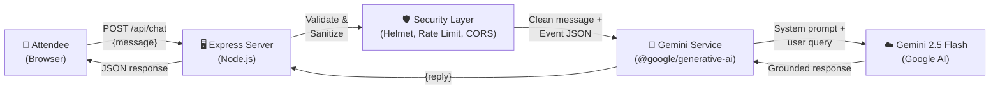

# EventAI Concierge

> AI-powered assistant that helps attendees navigate physical events — sessions, booths, directions, accessibility, and more — through a conversational chat interface powered by Gemini 2.5 Flash.

**Chosen Vertical:** Physical Event Experience

---

## Approach & Logic

EventAI Concierge was developed using **intent-driven prompting in Antigravity** with **Gemini 2.5 Flash** as the reasoning core. The entire codebase — backend, frontend, tests, and documentation — was scaffolded from a single comprehensive prompt, demonstrating how precise instructions can produce production-quality software.

### Why Chat-First UX?

At a busy physical event, attendees need answers *fast*. A chat interface is:

- **Familiar** — everyone knows how to text
- **Low friction** — no navigation menus to learn
- **Contextual** — natural language handles ambiguous queries ("anything about AI after 2pm?")
- **Accessible** — works with screen readers, keyboard navigation, and reduced-motion preferences

The AI is grounded in a structured event dataset so it never hallucinates venue details, and it proactively offers wheelchair-accessible route information when navigation questions arise.

---

## How It Works

### Architecture



### Request Flow

1. User types a question in the chat UI or clicks a suggestion chip
2. Frontend sends `POST /api/chat` with `{ message: "..." }`
3. Express validates the message (type, length 1-500 chars) and strips HTML tags
4. Rate limiter ensures ≤ 30 requests/minute per IP
5. Gemini service builds a system prompt embedding the full event dataset
6. Gemini 2.5 Flash generates a grounded, concise answer
7. Response is returned as `{ reply: "..." }` and rendered in the chat transcript

### Sample Queries

| Question | Expected Response |
|---|---|
| "When is the keynote?" | "The opening keynote, **The Ambient AI Era** by Dr. Kavitha Rajan, runs from 09:00–09:45 in Grand Hall A (Floor 1). Wheelchair-accessible seating is in rows 1-3." |
| "How do I get to Room 301 in a wheelchair?" | "Take the central elevator bank from the ground floor lobby to Floor 3. Room 301 is accessible via the Main Concourse Route — all corridors are ≥ 1.5 m wide." |
| "Where can I relax away from the crowd?" | "There are 3 quiet zones: **Zen Lounge** (Floor 1, West Wing), **Focus Pod Area** (Floor 2, bookable 30-min pods), and **Terrace Garden** (Floor 3, open-air)." |

---

## Features

- 📅 **Session Lookup** — Find talks by time, track, speaker, or topic
- 🗺️ **Venue Navigation** — Step-by-step directions between rooms, floors, and facilities
- 🏢 **Booth Discovery** — Search expo booths by company name or category
- ♿ **Accessibility First** — Wheelchair routes, hearing loops, and quiet zones surfaced proactively
- 💬 **Natural Language Q&A** — Ask anything about the event in plain English

---

## Google Services Integration

### Gemini 2.5 Flash

| Aspect | Detail |
|---|---|
| **What** | Google's Gemini 2.5 Flash model via the `@google/generative-ai` SDK |
| **Where** | `src/services/gemini.js` — called on every chat request |
| **How** | System prompt injects structured event JSON; user message is sent as the content; model generates grounded, concise answers |
| **Why** | Flash offers low-latency responses ideal for real-time event assistance. System instruction grounding prevents hallucination of venue details. |

---

## Assumptions

- Event data is a **static JSON dataset** representing a single conference (no live APIs)
- The application is **English-only** for this demo
- **Single-tenant** — one event at a time
- The Gemini API key is provided via environment variable (not bundled)

---

## Local Setup

```bash
# 1. Clone the repository
git clone https://github.com/Ritesh-Root/event-ai-concierge.git
cd event-ai-concierge

# 2. Install dependencies
npm install

# 3. Configure environment
cp .env.example .env
# Edit .env and add your GEMINI_API_KEY

# 4. Run tests
npm test

# 5. Start the server
npm start
# Open http://localhost:8080
```

### Scripts

| Command | Description |
|---|---|
| `npm start` | Start the production server |
| `npm run dev` | Start with `--watch` for development |
| `npm test` | Run Jest tests with coverage |
| `npm run lint` | Run ESLint |
| `npm run format` | Run Prettier |

---

## Accessibility (WCAG Compliance)

- ✅ Semantic HTML5 landmarks (`<header>`, `<main>`, `<footer>`)
- ✅ Skip-to-content link (visible on keyboard focus)
- ✅ `aria-live="polite"` on chat transcript for screen reader announcements
- ✅ `aria-busy` state during AI response loading
- ✅ `role="alert"` on error banners for immediate screen reader notification
- ✅ All interactive elements have `aria-label` or visible labels
- ✅ Color contrast ≥ 4.5:1 (WCAG AA) — verified with CSS custom properties
- ✅ Visible `:focus-visible` outlines (3px solid, high-contrast)
- ✅ `@media (prefers-reduced-motion: reduce)` disables all animations
- ✅ Proper form labels with `<label for>`
- ✅ `<button type="submit">` — no `<div onclick>` patterns
- ✅ Keyboard-accessible: Enter to send, Tab navigation throughout

---

## Security Measures

- 🔒 **Helmet** — sets security headers (CSP, HSTS, X-Content-Type-Options, X-Frame-Options)
- 🔒 **CORS** — restricted to same-origin requests only
- 🔒 **Rate Limiting** — 30 requests/minute per IP on `/api/chat`
- 🔒 **Input Validation** — message type check, length limit (1-500 chars)
- 🔒 **Input Sanitization** — HTML tag stripping to prevent XSS
- 🔒 **Environment Variables** — API keys read from `.env`, never hardcoded
- 🔒 **Body Size Limit** — JSON body capped at 16 KB
- 🔒 **No X-Powered-By** — Express fingerprint header removed by Helmet
- 🔒 **Graceful Shutdown** — SIGTERM/SIGINT handling prevents connection leaks

---

## License

MIT © Sunmount Solutions
